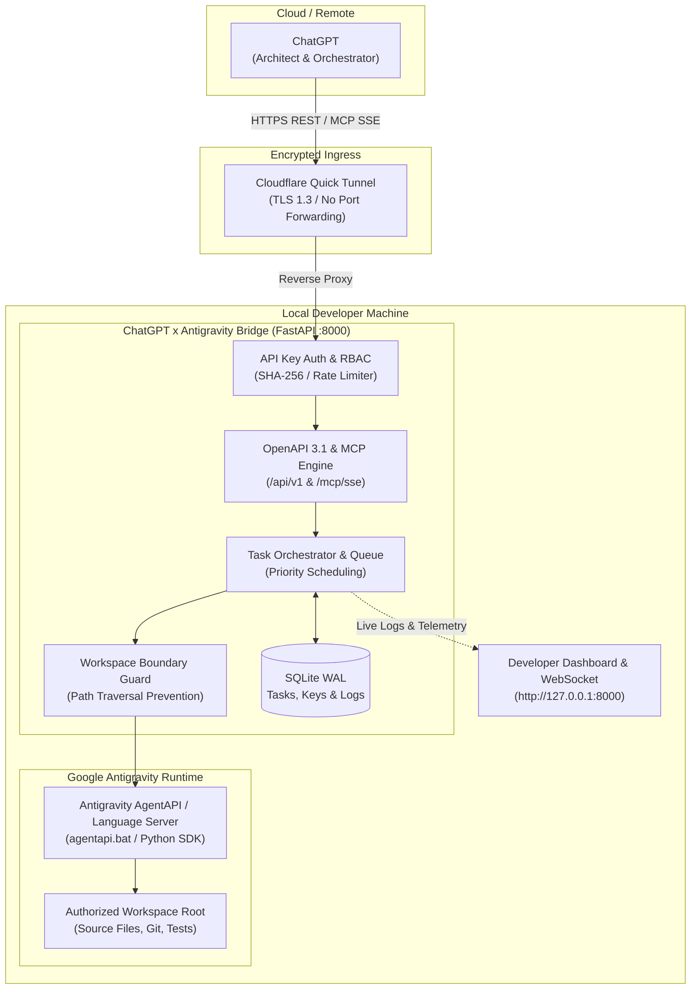
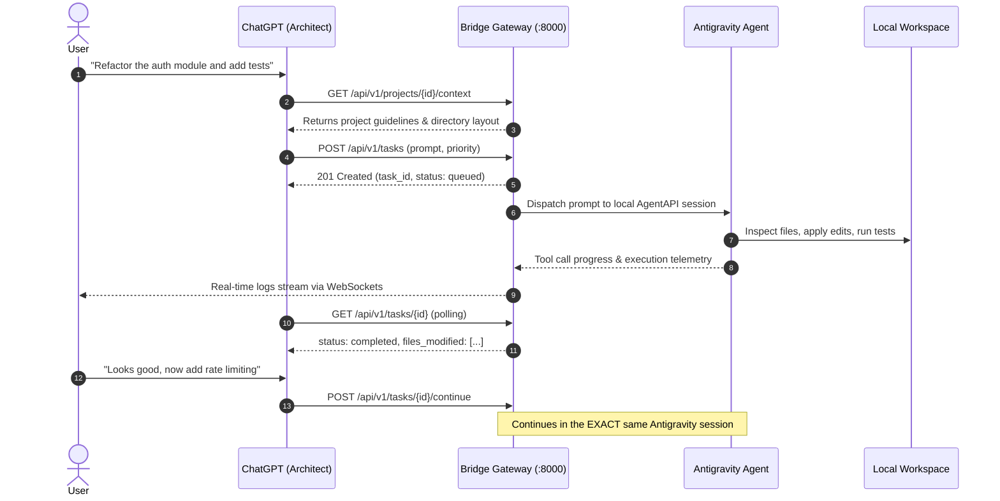

# ChatGPT x Antigravity Bridge

[](https://github.com/aiengmohamedtayal-netizen/ChatGPT-Antigravity-Bridge/actions/workflows/ci.yml)
[](https://www.python.org/)
[](LICENSE)
[](https://modelcontextprotocol.io/)

A local control plane connecting ChatGPT to Google Antigravity. It lets ChatGPT act as a system architect and planner, while Antigravity runs code modifications, terminal commands, and session persistence directly in your local workspace.

---

## Overview

When planning code changes in ChatGPT, there is usually a disconnect: ChatGPT excels at architectural thinking and feature breakdown, but it cannot touch your local filesystem or run builds. Conversely, local coding agents like Google Antigravity can edit files, run tests, and inspect git history, but work best when driven by clear task decomposition.

I built this bridge to connect the two without manual copy-pasting:

1. **ChatGPT** acts as the high-level architect through a Custom GPT Action (OpenAPI 3.1) or Remote MCP over Server-Sent Events (SSE).
2. **The Bridge Gateway** runs locally on FastAPI, validating requests, managing a priority queue, enforcing workspace filesystem boundaries, and storing audit logs in SQLite.
3. **Google Antigravity** receives dispatched tasks via its local AgentAPI / Language Server, modifies the target repository, and reports progress back through real-time WebSockets and SSE.

---

## Architecture



---

## Request & Task Lifecycle



---

## Key Features

- **Dual Control Interfaces**: Exposes an OpenAPI 3.1 schema for ChatGPT Custom Actions and a native MCP server (`/mcp/sse`) conforming to the 2024-11-05 specification.
- **Session Continuity**: Follow-up prompts reuse the existing Antigravity conversation session (`session_id`), allowing iterative refactoring without re-sending the whole codebase.
- **Priority Task Queue**: Background asynchronous scheduler prioritizing `urgent` > `high` > `normal` > `low` tasks.
- **Filesystem Boundary Guard**: Resolves canonical symlink-free paths to prevent directory traversal (`../`) attacks outside the registered workspace root.
- **Developer Dashboard**: Built-in web UI at `/dashboard` with live WebSocket execution logs, project workspace management, and API key generation.
- **Zero Port Forwarding**: Ships with an automated Cloudflare quick tunnel helper (`run_tunnel.py` / `START GATEWAY.bat`) establishing an end-to-end TLS 1.3 tunnel to `127.0.0.1:8000`.
- **Security**: Constant-time verification of SHA-256 hashed API keys, Fernet AES credential encryption, RBAC scopes, and token-bucket rate limiting via SlowAPI.

---

## Project Structure

```text
ChatGPT-Antigravity-Bridge/
|-- app/
|   |-- api/
|   |   |-- v1/                 # REST endpoints (tasks, projects, sessions, keys, audit)
|   |   `-- websockets.py       # Real-time task execution log streaming
|   |-- core/                   # Security, dependencies, rate limiting, error handlers
|   |-- mcp/                    # MCP server implementation, tools, and JSON-RPC protocol
|   |-- models/                 # SQLAlchemy data models (Task, Project, ApiKey, AuditLog)
|   |-- orchestration/          # Priority queue worker, state machine, context manager
|   |-- providers/              # Agent adapters (Antigravity Real, SDK, CLI, Simulated)
|   |-- schemas/                # Pydantic v2 validation models
|   |-- security/               # Filesystem boundary guard and path canonicalization
|   |-- static/                 # Developer dashboard and landing page assets
|   |-- config.py               # Pydantic settings with dynamic home path detection
|   |-- database.py             # SQLite engine setup (WAL mode enabled)
|   `-- main.py                 # FastAPI application factory and lifespan manager
|-- docs/
|   |-- ARCHITECTURE.md         # System topology and component design
|   |-- CHATGPT_SETUP.md        # Custom GPT Action & Remote MCP configuration guide
|   |-- MCP_GUIDE.md            # MCP tool definitions and Antigravity config
|   `-- SECURITY.md             # Threat model, RBAC scopes, and encryption
|-- scripts/
|   |-- gateway_manager.py      # Unified launcher with health checks and tunnel pairing
|   |-- test_real_gateway.py    # Local integration verification against live AgentAPI
|   `-- test_external_e2e.py    # End-to-end test verifying remote access through tunnel
|-- tests/                      # Automated test suite (Pytest + AsyncIO)
|-- .env.example                # Configuration template
|-- .gitignore                  # Ignores secrets, databases, and local binaries
|-- CONTRIBUTING.md             # Development guidelines and PR workflow
|-- LICENSE                     # MIT License
|-- requirements.txt            # Python dependencies
|-- run.py                      # Local server entrypoint
|-- run_tunnel.py               # Cloudflare quick tunnel launcher with auto-download
`-- START GATEWAY.bat           # Windows one-click launcher
```

---

## Quickstart

### 1. Prerequisites

- Python 3.10 or newer
- Git
- Google Antigravity installed locally (`~/.gemini/antigravity`)

### 2. Installation

Clone the repository and install dependencies in a virtual environment:

```bash
git clone https://github.com/aiengmohamedtayal-netizen/ChatGPT-Antigravity-Bridge.git
cd ChatGPT-Antigravity-Bridge

# Create and activate virtual environment
python -m venv .venv

# On Windows:
.venv\Scripts\activate

# On Linux / macOS:
source .venv/bin/activate

# Install dependencies
pip install -r requirements.txt
```

### 3. Environment Configuration

Copy the example environment file:

```bash
cp .env.example .env
```

The defaults work out of the box for standard Antigravity installations. On first launch, the server automatically generates a secure administrative API key and saves it to `.initial_api_key.txt` (which is gitignored).

---

## Running the Bridge

### Option A: One-Click Launcher (Windows)
Double-click `START GATEWAY.bat` or run:
```powershell
python scripts\gateway_manager.py
```
This checks server health, starts the FastAPI gateway, launches the Cloudflare tunnel, and copies the MCP endpoint directly to your clipboard.

### Option B: Manual Launch (Cross-Platform)

1. Start the Bridge API server:
   ```bash
   python run.py
   ```
   The server starts at `http://127.0.0.1:8000`:
   - Developer Dashboard: `http://127.0.0.1:8000/dashboard`
   - Interactive OpenAPI Docs: `http://127.0.0.1:8000/docs`
   - ChatGPT Action Schema: `http://127.0.0.1:8000/api/v1/chatgpt/openapi.json`

2. In a second terminal, start the secure public tunnel:
   ```bash
   python run_tunnel.py
   ```
   *(If `cloudflared` is not found on your system PATH or in `bin/`, the script automatically downloads the official Cloudflare binary for your operating system).*

> **Note on Quick Tunnels**: Cloudflare Quick Tunnels (`*.trycloudflare.com`) generate temporary, ephemeral URLs intended for development and local testing. Each restart assigns a new random URL. For a persistent setup, use a named Cloudflare Tunnel (`cloudflared tunnel run <name>`) or a custom reverse proxy domain.

---

## Agent Providers

The bridge decouples task orchestration from the underlying agent execution engine via a pluggable provider interface:

| Provider | Mode | Description |
|---|---|---|
| `simulated` | Standalone / Testing | In-memory mock agent with zero external dependencies. Simulates real-time task progression, code generation, and logs. Used in automated tests and ideal for exploring the dashboard or API without Antigravity installed. |
| `antigravity_real` | Local Production | Dispatches prompts to the local Google Antigravity Language Server via `agentapi.bat`. Directly modifies files, executes terminal commands, and persists conversation context in the user's `brain` directory. |
| `antigravity_sdk` | Native Python SDK | In-process Python integration using the Antigravity SDK when running inside an Antigravity-aware environment. |
| `claude_code` / `gemini_cli` | Extension Adapters | CLI adapters for dispatching tasks to other local agent tools. |

Switch providers in `.env`:
```ini
DEFAULT_AGENT_PROVIDER=antigravity
# Or for standalone testing:
# DEFAULT_AGENT_PROVIDER=simulated
```

## Connecting ChatGPT

### Using a Custom GPT (Web & Mobile)

1. Go to [chatgpt.com](https://chatgpt.com) -> **Explore GPTs** -> **Create**.
2. Under **Actions**, click **Create new action**.
3. Choose **Import from URL** and enter your tunnel schema URL:
   ```text
   https://<your-tunnel-url>.trycloudflare.com/api/v1/chatgpt/openapi.json
   ```
4. Configure Authentication:
   - **Authentication Type**: `API Key`
   - **Auth Type**: `Bearer`
   - **API Key**: Enter the key from `.initial_api_key.txt` (or create one in `/dashboard`).
5. Copy the system prompt template from [`docs/CHATGPT_SETUP.md`](docs/CHATGPT_SETUP.md) into the GPT Instructions.

### Using ChatGPT Desktop (Remote MCP)

Add the tunnel SSE URL to your desktop MCP settings:

```json
{
  "mcpServers": {
    "antigravity-bridge": {
      "url": "https://<your-tunnel-url>.trycloudflare.com/mcp/sse"
    }
  }
}
```

---

## MCP Tools Reference

### ChatGPT Control Plane Tools
These tools allow ChatGPT to inspect and drive the local environment:

| Tool | Parameters | Description |
|------|------------|-------------|
| `list_projects` | `enabled_only` | Discovers registered workspace directories |
| `get_project` | `project_id` | Returns metadata, path, and active session count |
| `get_project_context` | `project_id` | Reads project guidelines, `AGENTS.md`, and layout |
| `get_project_tree` | `project_id`, `subpath`, `max_depth` | Returns security-bounded directory tree |
| `list_agent_sessions` | `project_id` | Lists active Antigravity sessions |
| `create_agent_session` | `project_id`, `session_id` | Initializes an agent session |
| `send_agent_command` | `project_id`, `prompt`, `priority` | Dispatches task to Antigravity runtime |
| `continue_agent_session`| `parent_task_id`, `prompt` | Continues execution in the SAME agent session |
| `get_agent_session` | `session_id` | Retrieves conversation history |
| `get_task_status` | `task_id` | Checks state, duration, and files changed |
| `get_task_events` | `task_id`, `since_seq` | Streams live execution telemetry |
| `cancel_agent_session` | `task_id` | Aborts a running task cleanly |

### Antigravity Callback Tools
Tools used by Antigravity to report back to the bridge:

| Tool | Parameters | Description |
|------|------------|-------------|
| `bridge_get_project_context` | `project_id` | Fetches workspace context and guidelines |
| `bridge_report_task_progress` | `task_id`, `message`, `level` | Streams execution progress to dashboard |
| `bridge_store_task_artifact` | `task_id`, `filename`, `content` | Persists generated diffs and files |
| `bridge_query_task_history` | `project_id`, `limit` | Queries past architectural decisions |

---

## Testing

Run the automated test suite:

```bash
python -m pytest tests/ -v
```

All 21 tests execute against an in-memory SQLite database using a simulated provider, completing in under 2 seconds:
- API key hashing and Fernet AES encryption roundtrip
- Bearer token authentication and RBAC scope enforcement
- Priority queue scheduling and idempotency deduplication
- Multi-turn session continuation context preservation
- MCP JSON-RPC 2.0 handshake and tool execution
- End-to-end ChatGPT action workflow simulation

---

## Security Model

- **No Inbound Open Ports**: The server binds to `127.0.0.1`. Remote traffic reaches it only via an outbound Cloudflare tunnel.
- **Filesystem Isolation**: File inspection and execution are restricted to paths verified by `WorkspaceBoundaryGuard`. Escapes via `..` or alternate drive letters are blocked.
- **Hashed Secrets**: API keys are generated using cryptographically secure random tokens (`secrets.token_urlsafe`), hashed with SHA-256, and verified using `secrets.compare_digest` to prevent timing attacks.
- **Encrypted Credentials**: Provider credentials stored in SQLite are encrypted with Fernet (AES-128-CBC with HMAC-SHA256 authentication) derived from `BRIDGE_SECRET_KEY`.

See [`docs/SECURITY.md`](docs/SECURITY.md) for full security documentation.

---

## Troubleshooting

### Port 8000 already in use
Change the port in `.env` or set the environment variable:
```bash
PORT=8080 python run.py
```

### Antigravity agentapi path not found
If your Antigravity installation is in a non-standard directory, set the path in `.env`:
```ini
ANTIGRAVITY_AGENTAPI_PATH=C:\CustomPath\.gemini\antigravity\bin\agentapi.bat
ANTIGRAVITY_BRAIN_DIR=C:\CustomPath\.gemini\antigravity\brain
```

### Tunnel does not establish
Ensure outgoing HTTPS traffic is allowed. You can test `cloudflared` directly:
```bash
python run_tunnel.py
```
If you are behind a corporate proxy, check your system proxy environment variables (`HTTPS_PROXY`).

---

## Contributing

Contributions, bug reports, and suggestions are welcome. Please read [`CONTRIBUTING.md`](CONTRIBUTING.md) for guidelines on branch naming, code style, and running the test suite.

---

## License

This project is licensed under the [MIT License](LICENSE) - see the [LICENSE](LICENSE) file for details.
